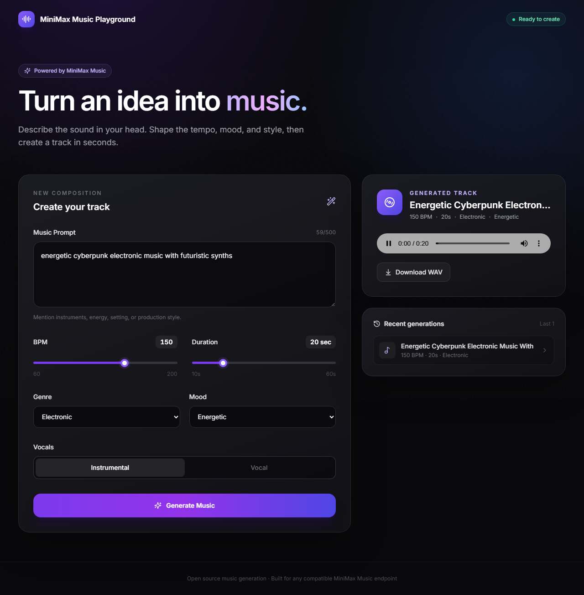

# MiniMax Music Playground

An open-source text-to-music web application powered by a configurable MiniMax Music inference endpoint. Describe a track, set the tempo and duration, choose a genre and mood, then generate, play, and download the result in one interface.

The project includes a mock inference mode and a bundled demo track, so the complete user flow works immediately without a GPU or model server.



## Features

- Text-to-music prompt with a 500-character limit
- BPM control from 60 to 200
- Duration control from 10 to 60 seconds
- Genre and mood selection
- Instrumental and vocal modes with optional lyrics
- Clear multi-step generation state
- Native, accessible audio player with seek and volume controls
- WAV download
- Five most recent generations stored in the browser
- FastAPI provider layer for a swappable inference contract
- Mock inference for local development and automated tests
- Responsive, semantic, automation-friendly UI

## Architecture

```text
Browser
  ↓
React + Vite
  ↓ POST /api/generate
FastAPI
  ↓
MusicProvider
  ├─ MockMusicProvider
  └─ MiniMaxProvider
       ↓
MINIMAX_ENDPOINT
```

The frontend never calls the model endpoint directly. The FastAPI backend enriches the user prompt and delegates generation to a provider. If a compatible server uses a different request or response shape, only [`backend/app/providers/minimax.py`](backend/app/providers/minimax.py) needs to change.

## Quick start with Docker

Requirements: Docker Desktop or Docker Engine with Compose.

```bash
cp .env.example .env
docker compose up --build
```

Open [http://localhost:3000](http://localhost:3000). Mock inference is enabled by default and returns the bundled demo WAV after a short delay. The backend API and interactive OpenAPI documentation are available at [http://localhost:8000/docs](http://localhost:8000/docs).

To stop the application:

```bash
docker compose down
```

## Local development

### Backend

Use Python 3.11 or newer.

```bash
cd backend
python -m venv .venv
```

Activate the environment:

```bash
# macOS/Linux
source .venv/bin/activate

# Windows PowerShell
.venv\Scripts\Activate.ps1
```

Install and run:

```bash
pip install -r requirements-dev.txt
uvicorn app.main:app --reload --port 8000
```

Verify the server:

```bash
curl http://localhost:8000/api/health
```

### Frontend

Use Node.js 20 or newer.

```bash
cd frontend
npm install
npm run dev
```

Open [http://localhost:5173](http://localhost:5173). Vite proxies `/api` and `/outputs` to the backend at port 8000.

## Environment variables

Copy `.env.example` to `.env` for Docker Compose. For direct backend development, export the same values in your shell or use your preferred environment loader.

| Variable | Default | Description |
| --- | --- | --- |
| `APP_NAME` | `MiniMax Music Playground` | Application name used by the API |
| `MINIMAX_ENDPOINT` | `http://localhost:8000` | Base URL of a compatible inference server |
| `MINIMAX_GENERATE_PATH` | `/generate` | Inference generation path |
| `MOCK_INFERENCE` | `true` | Uses the bundled mock provider when true |
| `MOCK_DELAY_SECONDS` | `2.5` | Artificial mock generation delay |
| `INFERENCE_TIMEOUT_SECONDS` | `180` | Real inference request timeout |
| `CORS_ORIGINS` | Local development origins | Comma-separated allowed frontend origins |
| `VITE_API_URL` | Empty | Optional absolute backend URL for the frontend |
| `VITE_APP_NAME` | `MiniMax Music Playground` | Optional frontend brand name |

Do not put private API keys in source control. If your inference server requires authentication, add the relevant secret as an environment variable and apply it only inside the provider adapter.

## Connect a MiniMax inference server

Set mock mode to false and point the backend to the inference service:

```env
MOCK_INFERENCE=false
MINIMAX_ENDPOINT=http://localhost:9000
MINIMAX_GENERATE_PATH=/generate
```

The included adapter sends:

```json
{
  "prompt": "Enhanced prompt with genre, mood, BPM, duration, and vocal mode",
  "original_prompt": "The user's original prompt",
  "bpm": 128,
  "duration": 20,
  "genre": "Electronic",
  "mood": "Energetic",
  "vocal": false,
  "lyrics": null
}
```

The adapter accepts any of these response formats:

- Raw audio bytes with an `audio/*` or `application/octet-stream` content type
- JSON containing `audioUrl`, `audio_url`, or `url`
- JSON containing `audioBase64` or `audio_base64`

Change `backend/app/providers/minimax.py` if your server uses a different contract. The rest of the application remains unchanged.

## API

### `GET /api/health`

```json
{ "status": "ok" }
```

### `POST /api/generate`

```json
{
  "prompt": "energetic cyberpunk electronic music",
  "bpm": 128,
  "duration": 20,
  "genre": "Electronic",
  "mood": "Energetic",
  "vocal": false,
  "lyrics": null
}
```

Example response:

```json
{
  "id": "generation-id",
  "status": "completed",
  "audioUrl": "/outputs/example.wav",
  "title": "Energetic Cyberpunk Electronic Music",
  "metadata": {
    "bpm": 128,
    "duration": 20,
    "genre": "Electronic",
    "mood": "Energetic"
  }
}
```

## Tests

Frontend unit tests:

```bash
cd frontend
npm test
```

Backend API and provider tests:

```bash
cd backend
pytest
```

Playwright acceptance flow:

```bash
cd frontend
npx playwright install chromium
npm run test:e2e
```

Run the command from an environment where the backend requirements are installed. Playwright starts both development servers automatically. The E2E test covers the real FastAPI mock flow, including prompt input, BPM adjustment, generation loading, audio playback, result rendering, and a mobile overflow check.

## Project structure

```text
.
├── backend/
│   ├── app/
│   │   ├── api/             # FastAPI routes
│   │   ├── providers/       # Mock and MiniMax adapters
│   │   ├── services/        # Prompt and generation orchestration
│   │   ├── assets/          # Bundled demo audio
│   │   ├── config.py
│   │   ├── main.py
│   │   └── models.py
│   ├── tests/
│   └── Dockerfile
├── frontend/
│   ├── e2e/
│   ├── src/
│   └── Dockerfile
├── scripts/
├── compose.yaml
└── .env.example
```

## License

MIT. See [LICENSE](LICENSE).
